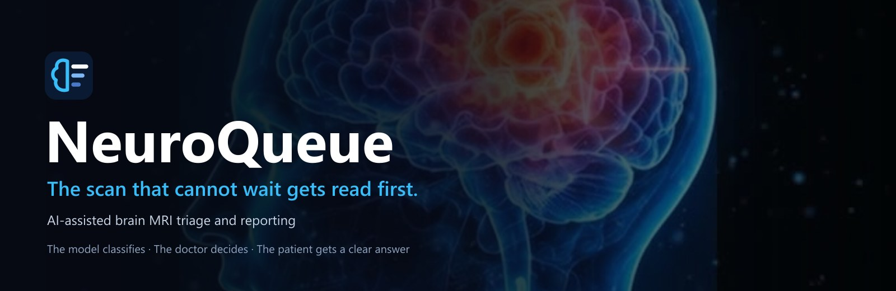
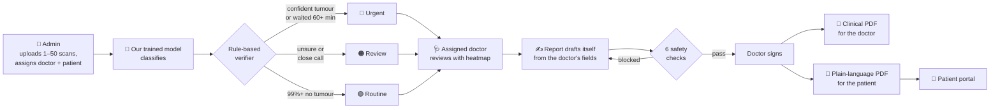
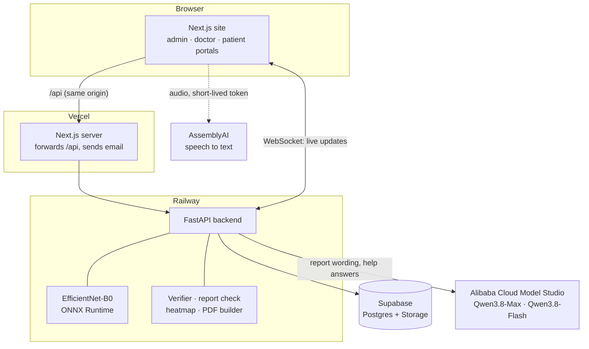

<div align="center">



<br><br>

[](https://neuroqueue-one.vercel.app)
[](submission/NeuroQueue-launch-video.mp4)
[](submission/NeuroQueue-Pitch-Deck.pptx)
[](submission/NeuroQueue-Project-Summary.pdf)


**Alibaba Cloud · Qoder · ZAKA AI Hackathon** &nbsp;·&nbsp; Team **Import Innovation**

</div>

> **Decision support only, not a diagnosis. Every scan is read by a doctor.**
> Routine means "read last", never "cleared". Nothing reaches a patient until a doctor has signed it.

---

## Contents

[The idea](#the-idea) · [How it works](#how-it-works) · [See it](#see-it) · [Results](#results) · [AI and models](#ai-and-models) · [Architecture](#architecture) · [Tech stack](#tech-stack) · [Repository layout](#repository-layout) · [Run it](#run-it) · [Safety design](#safety-design) · [API](#api) · [Future scope](#future-scope) · [Limits](#limits) · [Team](#team)

---

## The idea

Brain MRI scans are usually read in the order they arrive, so **a scan showing a tumour waits behind every normal scan that came before it**. Then the doctor types the report by hand, and the patient receives a document written for clinicians.

NeuroQueue fixes the order and removes the blank page. Three jobs, and they never blur:

| | Who | What they do | What they never do |
|---|---|---|---|
| 🧠 | **Our trained model** | Classifies every scan: glioma, meningioma, pituitary tumour or no tumour, with a calibrated confidence | — it is the only classifier |
| 🩺 | **The doctor** | Reviews every scan, confirms or overrides the model, and signs every report | — |
| ✍️ | **The language model (Qwen)** | Words the report from the doctor's confirmed fields; powers the help assistant | Never sees the image, never classifies, never approves a report |

**In one sentence:** we help radiology departments, their doctors and the patients waiting on them solve urgent brain MRI scans waiting in a first-come queue while every report is written by hand, through NeuroQueue and our own trained MRI classifier with a rule-based safety verifier, improving the wait for tumour scans to a simulated mean of **6.5 minutes instead of 17.8**, with no increase in total waiting.

## How it works



| Step | What happens |
|---|---|
| **1. Admin uploads and assigns** | One image or up to 50 at once. The admin chooses the doctor and the patient, which links them |
| **2. The trained model classifies** | Four classes with a calibrated confidence. Starts automatically after upload |
| **3. A rule-based verifier sets the tier** | Urgent, Review or Routine, with the reason shown. A scan waiting over 60 minutes is escalated to Urgent |
| **4. The assigned doctor reviews** | Image, probability of every class, and a heatmap of where the model looked. Confirm, or override with a reason |
| **5. The report drafts itself** | A clinical report and a plain-language finding, written only from what the doctor confirmed |
| **6. Six checks must pass** | A tumour type, size or location that differs from the review, or any malignancy wording, blocks signing |
| **7. The doctor signs** | Two PDFs are created: clinical for the doctor, plain-language for the patient |
| **8. The patient receives it** | The patient portal shows only their own finalized report |

Every step updates live on every open screen and is written to a tamper-evident audit log.

### Three portals

| Portal | What the person does |
|---|---|
| **Administrator** | Uploads scans, assigns each batch to a doctor and a patient, approves doctor registrations, manages users, oversees the system |
| **Doctor** | Sees **only** the scans assigned to them. Reviews, confirms or overrides, approves and signs |
| **Patient** | Sees and downloads only their own doctor-finalized report, in plain language |

## See it

**▶ [Watch the 78-second launch video](submission/NeuroQueue-launch-video.mp4)** &nbsp;·&nbsp; **[Try the live site](https://neuroqueue-one.vercel.app)**

| Admin uploads and assigns | The model sorts the queue |
|---|---|
|  |  |
| **Doctor reviews with the heatmap** | **The report drafts itself** |
|  |  |
| **Checks passed, report signed** | **Clinical PDF for the doctor** |
|  |  |
| **Plain-language PDF for the patient** | **Patient portal** |
|  |  |

<details>
<summary><b>More screenshots:</b> metrics, audit log, dashboard, Arabic, voice assistant</summary>
<br>

| Model metrics | Tamper-evident audit log |
|---|---|
|  |  |
| **Live admin dashboard** | **English and Arabic** |
|  |  |
| **Voice help assistant** | **Doctor sees only assigned scans** |
|  |  |

</details>

## Results

### The model, on 901 scans it had never seen

| Measure | Result |
|---|---|
| **Test accuracy** | **98.67%** |
| **Tumour recall** (tumour vs no tumour) | **99.1%** |
| Per-class recall | glioma 98.9% · meningioma 98.0% · pituitary 99.2% · no tumour 98.5% |
| Misclassified scans | 12 of 901 |
| **Of those, still sent to Urgent or Review by the verifier** | **11 of 12** |
| Calibration error (ECE) | 0.004 after temperature scaling (0.008 before) |
| Scans sent to the Review tier | 4.6% |
| True tumours tiered Routine | 1 of 765 — which is why Routine scans are still read |

How the number is kept honest: **1,144 duplicate images and 49 with conflicting labels were removed before splitting**, so no image is in both training and test. Thresholds were tuned on the validation split only, and the test set was measured once.

### The queue, in simulation

| Wait before a doctor opens the scan | First come, first served | NeuroQueue |
|---|---|---|
| **Tumour scans, mean** | 17.8 min | **6.5 min** |
| **Tumour scans, 90th percentile** | 43.3 min | **11.7 min** |
| No-tumour scans, mean | 17.4 min | 21.1 min |
| All scans, mean | 17.5 min | 17.5 min |

Same doctor, same day, same total waiting — a better order. Assumptions: one radiologist, 9 scans per hour, 6 minutes per read, 200 simulated days, using the model's real held-out predictions. **These are simulated waiting times, not clinical outcomes.** Reproduce with `python sim/queue_simulation.py`.

## AI and models

### Which model runs where, and how it is called

| Model | Where it is used | How it is called |
|---|---|---|
| **EfficientNet-B0, trained by us** | Classifies every uploaded scan. The only classifier | Runs inside our backend as ONNX. No outside service sees the image |
| **Deterministic verifier** (rules, no AI) | Turns probabilities and waiting time into a tier with a stated reason | Plain code in `backend/app/services/verifier.py`. It can never mark a scan as cleared |
| **Qwen3.8-Max** (Alibaba Cloud Model Studio) | Drafts the report wording after the doctor's review; translated the interface into Arabic | From the backend only. Receives the doctor's confirmed fields, never the image |
| **Qwen3.8-Flash** (Alibaba Cloud Model Studio) | Help assistant answers; plain-language "why this tier" explanation | From the backend only, streamed word by word |
| **AssemblyAI streaming** | Voice input for the help assistant | The browser streams audio with a 5-minute token from our backend; the key stays on the server |

Qwen is not used for classification anywhere, and no language model judges a report.

### How the model was trained (`/ml`)

`python -m ml.train` runs the whole reproducible pipeline with a fixed seed:

```
perceptual-hash de-duplication → stratified train / val / test split → EfficientNet-B0 fine-tune
→ temperature scaling → threshold search on validation → one evaluation on test → ONNX export
```

| | |
|---|---|
| Dataset | Brain Tumor MRI Dataset (Kaggle, M. Nickparvar, CC0), 7,200 images indexed, 6,007 kept, split 70 / 15 / 15 |
| Model | EfficientNet-B0 from ImageNet weights, 224 × 224 input, 12 epochs, AdamW, one-cycle learning rate |
| Calibration | Temperature scaling, T = 1.37 |
| Heatmap | Occlusion sensitivity: cover one patch at a time and measure how far the confidence drops |
| Output | `ml/artifacts/model.onnx`, `metrics.json`, `thresholds.json`, 20 demo scans |

`ml/NeuroQueue_training.ipynb` runs the same pipeline on a free Kaggle or Colab GPU. `python backend/verify_model.py` runs all 901 test images through the exact serving path and confirms the served model matches training.

### Triage rules

Evaluated in this order; the first match decides the tier.

| # | Condition | Tier | Reason shown |
|---|---|---|---|
| 1 | Waited longer than 60 minutes | 🔴 Urgent | `ESCALATED_WAIT` |
| 2 | Top confidence below 0.94 | 🟠 Review | `LOW_CONFIDENCE` |
| 3 | Gap between the top two classes below 0.60 | 🟠 Review | `CLOSE_CALL` |
| 4 | Image unlike the training data | 🟠 Review | `OUT_OF_DISTRIBUTION` |
| 5 | Confident tumour class | 🔴 Urgent | `CONFIDENT_TUMOR` |
| 6 | No tumour with confidence of 0.99 or more | 🟢 Routine | `CONFIDENT_NO_TUMOR` |

### Built with Qoder

We used **Qoder**, with the **Qwen3.8-Max** model selected, for two parts of the build: **integrating the interface animations** into the web application, and writing **some of the SQL queries** for the database schema.


*An early Qoder development session with Qwen3.8-Max selected, working on the database schema SQL.*

## Architecture



- The browser never talks to the database. Row-level security is on for every table.
- The scan image never leaves the backend for classification.
- API keys stay on the server; the voice assistant uses a 5-minute token.

## Tech stack

| Layer | Technology |
|---|---|
| **Frontend** | Next.js 15 (App Router), React 19, TypeScript, Tailwind CSS 4, Framer Motion (animations), three.js + React Three Fiber (3D brain), Recharts (charts), Lucide icons |
| **Backend** | Python 3.11, FastAPI, Uvicorn, Pydantic, ONNX Runtime, Pillow, NumPy, PyJWT, httpx, ReportLab (PDFs), WebSockets |
| **Model training** | PyTorch, torchvision, EfficientNet-B0, exported to ONNX |
| **AI services** | Alibaba Cloud Model Studio (Qwen3.8-Max, Qwen3.8-Flash), AssemblyAI streaming |
| **Data** | Supabase Postgres with row-level security, Supabase Storage (private) |
| **Hosting** | Vercel (site), Railway + Docker (backend and model) |
| **Quality** | 87 automated backend tests (pytest), model verification script |
| **Built with** | Qoder (animation integration, some SQL queries) |

## Repository layout

```
NeuroQueue/
├── backend/                 FastAPI server
│   ├── app/
│   │   ├── api/             auth, scans, reports, insights, assist (HTTP endpoints)
│   │   ├── services/        classifier, verifier, heatmap, report writer, report check, PDF, audit, accounts
│   │   ├── store/           Supabase and local JSON storage behind one interface
│   │   ├── auth.py          sessions, password hashing, role guards
│   │   ├── realtime.py      WebSocket hub and streamed jobs
│   │   └── main.py          app, security middleware, CORS
│   ├── tests/               87 tests, run offline
│   ├── seed.py              creates the admin and demo accounts
│   └── verify_model.py      checks the served model against training
├── frontend/                Next.js site
│   ├── app/                 pages: home, login, register, help, admin/, doctor/, patient/
│   ├── components/          queue, uploader, review, dashboards, 3D brain, help assistant
│   └── lib/                 API client, auth, realtime, voice, English/Arabic (i18n)
├── ml/                      training pipeline, notebook, and artifacts (model.onnx, metrics, thresholds, demo scans)
├── sim/                     queue simulation (first-come vs NeuroQueue)
├── supabase/                database schema and service account SQL
├── docs/                    deployment guide and README assets
├── submission/              hackathon submission: summary PDF, pitch deck, video, document, screenshots
├── Dockerfile               backend container (used by Railway)
└── Makefile · dev.ps1       shortcuts for dev, test, train, sim, seed
```

## Run it

Requirements: Python 3.11 and Node 20 or newer.

```bash
# 1. backend
python -m venv .venv
.venv/Scripts/python -m pip install -r backend/requirements.txt      # Linux/macOS: .venv/bin/python
cp backend/.env.example backend/.env                                 # then fill in the keys
cd backend
../.venv/Scripts/python seed.py                                      # admin + demo doctor + demo patient
../.venv/Scripts/python -m uvicorn app.main:app --port 8000

# 2. frontend (second terminal)
cd frontend
npm install --legacy-peer-deps
npm run dev                                                          # http://localhost:3000
```

`make dev`, `make test`, `make train`, `make sim`, `make seed` wrap the same commands (on Windows use `./dev.ps1 <target>`).

Sign-in details for the seeded accounts are in your own `backend/.env` (`ADMIN_*`, `DEMO_DOCTOR_*`, `DEMO_PATIENT_*`). Registering a new admin on the site needs `ADMIN_INVITE_CODE` from the same file.

<details>
<summary><b>Demo in two minutes</b></summary>
<br>

1. Sign in as **admin**, open **Upload scans**, choose a doctor, and press **Load 20 demo scans for this doctor**. Classification starts by itself.
2. Open **Queue**: Urgent scans rise to the top. `demo_15` (a true meningioma the model calls "no tumour" at about 50%) lands in Review.
3. Sign in as that **doctor**, open **My scans**, open a scan, toggle the heatmap, then confirm, or **Override** with a reason and add size and location.
4. The report streams in and the check rows turn green. Type your name and **Approve and finalize**, then download the PDF.
5. Edit a draft to add "likely malignant, 45 mm" and re-run the check: it is blocked, and approval is refused.
6. As admin, upload your own images for a real patient account, finalize as the doctor, then sign in as that **patient** to see the report.

</details>

<details>
<summary><b>Mock mode (no network, no keys)</b></summary>
<br>

Set `NQ_MOCK_MODE=true` in `backend/.env`. The classifier, Qwen and voice providers are replaced with deterministic mocks and data is kept in a local store. The whole flow, including the test suite, runs offline.

</details>

<details>
<summary><b>Database setup (Supabase)</b></summary>
<br>

Without Supabase settings the backend uses a local JSON store in `backend/data/` (fully functional on one machine). To use Supabase:

1. Create a project in the Supabase dashboard.
2. Run `supabase/schema.sql` in the SQL editor, then `supabase/service_account.sql`.
3. In `backend/.env` set `SUPABASE_URL`, `SUPABASE_ANON_KEY`, `SUPABASE_SERVICE_EMAIL` and `SUPABASE_SERVICE_PASSWORD`.
4. Restart the backend and run `python seed.py`. `GET /api/health` should report `"store": "supabase"`.

</details>

<details>
<summary><b>Deployment</b></summary>
<br>

- **Site:** Vercel, from `frontend/`. Set `BACKEND_URL` (the backend address) and `NEXT_PUBLIC_WS_URL` (its `wss://.../ws` address).
- **Backend:** Railway, from the root `Dockerfile`. Copy the variables from `backend/.env`, and set `APP_URL` and `CORS_ORIGINS` to the site address, `COOKIE_SECURE=true` and `TRUST_PROXY=true`.
- **Email on hosts that block SMTP:** set `MAIL_RELAY_URL` and `MAIL_RELAY_SECRET` on the backend and `MAIL_RELAY_SECRET` plus `SMTP_*` on the site; the site then sends the email.

More in [`docs/DEPLOY.md`](docs/DEPLOY.md).

</details>

### Tests

```bash
cd backend && ../.venv/Scripts/python -m pytest tests -q        # 87 tests, offline
```

They cover every verifier rule and the rule order, threshold edges, escalation, report-check contradiction and invented-detail cases, the live stream guard, the sign-off gate, audit-chain tamper detection, PDF export, access control for all three roles, admin upload and doctor assignment, and one end-to-end run from upload to signed PDF. Safety tests assert that nothing can be signed without a review, a blocked report cannot be released, no language model is called during classification, and no status means "cleared".

## Safety design

| Risk | Control already in the product |
|---|---|
| The model is wrong | A doctor reads every scan. Low-confidence and close-call predictions go to Review. An override is one click and is logged |
| A tumour scan is ranked Routine | Routine needs 99% confidence in no tumour. Anything waiting over 60 minutes is escalated to Urgent |
| The language model invents a finding | It receives only the doctor's confirmed fields. A rule-based check compares the text against them, and forbidden phrases stop the draft as it is written |
| A patient sees someone else's data | Access is enforced on the server by role and ownership. Patients receive finalized reports only, never model output |
| A doctor opens scans that are not theirs | Each scan is assigned to one doctor; the server refuses every other doctor |
| Records are changed afterwards | Append-only audit log where each entry stores the hash of the one before it |

<details>
<summary><b>Reports: two versions from one source</b></summary>
<br>

The doctor's review (finding, size, location, notes, symptoms, history, treatment plan, medicines, follow-up, patient instructions, warning signs) is the single source of truth. Two separate documents are built from it.

| | Doctor report | Patient report |
|---|---|---|
| Audience | Medical professionals | The patient |
| Contains | Clinical information, model classification with probabilities, findings and impression, treatment plan, medication table, physician approval, model details | Visit summary, what the doctor found, the result in plain words, treatment, medicines, what to do next, follow-up, when to seek help |
| Never contains | | Clinical notes, history, probabilities, triage tier, model details, the clinical report text |

- The server decides which version to send from the signed-in role. A patient always gets the patient version, whatever the request asks for.
- Treatment, medicines, follow-up and warning signs appear in the patient report in the doctor's exact words, so a dose or instruction can never be altered.
- Anything not recorded is printed as "Not provided".
- Status: Draft → AI-generated draft → Under physician review → Approved and finalized. Each report has a unique ID, `NQ-YYYYMMDD-XXXXXX`.

</details>

<details>
<summary><b>Accounts and security</b></summary>
<br>

- **Sign-up** creates an unverified account and emails a single-use link (24 hours). No session until the email is verified.
- **Doctors** need administrator approval before they can reach any clinical page.
- **Sessions** are a signed token in an `HttpOnly`, `SameSite` cookie. JavaScript never sees a token and none is ever put in a URL. Changing or resetting a password, disabling an account, or "sign out on every device" ends all sessions.
- **Passwords** are hashed with scrypt. **Password reset** uses a single-use link valid for 30 minutes, with the same response whether or not the address has an account.
- **Google sign-in:** the ID token is verified on the server (signature, audience, issuer). An existing account with the same verified address is linked, not duplicated.
- **Throttling:** per-IP and per-address limits on sign-in, sign-up, verification and reset; 5 wrong passwords lock sign-in for that address for 15 minutes.
- **CSRF and CORS:** state-changing requests from any other origin are refused; CORS lists explicit origins only. The WebSocket uses a one-time 30-second ticket and refuses other origins.
- **Headers:** Content-Security-Policy, `nosniff`, frame protection, `Referrer-Policy`, `Permissions-Policy` (microphone for this site only), HSTS in production.
- **Input:** request bodies reject unknown fields and enforce length limits; uploads are checked by content, not extension.

</details>

## API

```
POST /api/auth/register | login | google | verify-email | forgot-password | reset-password | change-password | logout
GET  /api/auth/me                 POST /api/auth/ws-ticket
GET  /api/users                   POST /api/users/{id}/status      admin: approve / reject / disable
GET  /api/doctors | /api/patients                                  admin: who a scan can be assigned to
POST /api/scans/batch             admin only: images + doctor + patient -> Scan[]
POST /api/scans/{id}/assign       admin only: move an unreviewed scan to another doctor
POST /api/scans/{id}/classify     POST /api/queue/process          streamed jobs
GET  /api/queue                   admin: every scan · doctor: only assigned scans
GET  /api/scans/{id}              scan + prediction + verifier reasons
GET  /api/scans/{id}/image | /heatmap | /pdf | /report | /patient-version
POST /api/scans/{id}/review       assigned doctor: confirm or override (logged)
POST /api/scans/{id}/draft        streamed draft + report check
POST /api/scans/{id}/check        re-check after an edit
POST /api/scans/{id}/sign         approve and finalize: only if reviewed, check passed and doctor named
GET  /api/my/scans                patient: own examinations and finalized reports only
GET  /api/metrics | /api/audit | /api/stats/overview | /api/health
POST /api/assist/chat             streamed help assistant           GET /api/assist/voice-token
WS   /ws                          scan_updated, job_started, job_progress, job_token, job_done, job_failed, ...
```

Errors are always `{code, message, hint}`. Stack traces and secrets are never returned.

## Future scope

| | Idea | What it adds |
|---|---|---|
| 1 | **PACS and RIS integration** | Pull scans directly from the hospital's imaging system and push the signed report back, so nobody uploads anything by hand |
| 2 | **Arabic reports** | The interface is already bilingual; next, the PDFs and the patient summary in Arabic too |
| 3 | **Notifications** | An SMS or email to the patient when their report is ready, and an alert to the doctor when an Urgent scan is assigned |
| 4 | **Beyond brain tumours** | Today it handles brain tumours. The same queue-and-report flow can serve any tumour type with a model trained for it |
| 5 | **Tumour segmentation** | Outline the tumour and measure its size automatically, so the doctor confirms a measurement instead of typing one |
| 6 | **Mobile app** | Patients view their report on their phone; doctors get urgent alerts |

**Before real clinical use:** validation on other scanners and sites with radiologist-labelled data, a reader study measuring real time-to-read, and compliant hosting with the regulatory pathway for decision-support software.

## Limits

- Trained and tested on public 2D MRI images from a single dataset. Performance on other scanners, sequences and protocols is unknown.
- Four classes only. It makes no malignancy or grading claims and uses no patient history.
- Takes JPEG or PNG slices today, not DICOM studies.
- The waiting-time result is a simulation and depends entirely on the stated assumptions.
- The PDFs and the patient summary are English only.
- Rate limits and sign-in lockouts are held in memory, so they reset on restart and do not span multiple servers.
- Hackathon-grade security work on demo hosting; not a certified or audited medical system.
- **Not a medical device.**

## Team

**Team Import Innovation**

| Member | Role | Owns |
|---|---|---|
| **Veera Siva Abhishek** | Team lead | Backend with Sanmeet · Google sign-in and account access · portal design and workflows after login · English and Arabic experience · chatbot and voice assistant integration |
| **Sanmeet** | AI model and backend | Dataset, training and evaluation of the model, and the backend with Abhishek |
| **Veera Siva Abhiram** | Web application | The web interface and its animations |
| **Mohamed Abubakker** | Audit | The audit trail inside the web application |

The whole team owns the product decisions and the safety rules.

**Contact:** 2200031362csehh@gmail.com · +971 528813637

---

<div align="center">

**The model classifies. The doctor decides. The patient gets a clear answer.**

[Live site](https://neuroqueue-one.vercel.app) · [Launch video](submission/NeuroQueue-launch-video.mp4) · [Pitch deck](submission/NeuroQueue-Pitch-Deck.pptx) · [Project summary](submission/NeuroQueue-Project-Summary.pdf) · [Submission document](submission/SUBMISSION.md)

<sub>Decision support only, not a diagnosis. Every scan is read by a doctor.</sub>

</div>
