# NeuroQueue — Hackathon Project Submission

**Live product:** https://neuroqueue-one.vercel.app  ·  **Launch video (78 s):** `NeuroQueue-launch-video.mp4`  ·  **Screenshots:** `screenshots/`

> We help **radiology departments, their doctors and the patients waiting on them** solve **urgent brain MRI scans waiting in a first-come queue while every report is written by hand** through **NeuroQueue, a real-time triage and reporting web platform** and **our own trained MRI classifier with a rule-based safety verifier, plus an LLM that only words the report**, improving **time to read for urgent scans** to **a simulated mean wait of 6.5 minutes instead of 17.8 (90th percentile 11.7 instead of 43.3) with no increase in overall waiting time**.

*Decision support only, not a diagnosis. Every scan is read by a doctor.*

---

## 01 · Project Summary

**Purpose.** NeuroQueue makes sure the brain MRI scan that cannot wait is read first, and that the doctor who reads it gets a finished draft report instead of a blank page.

**What it is.** A deployed web application with three portals:

| Portal | What the person does |
|---|---|
| **Administrator** | Uploads one or many MRI scans, assigns each batch to a doctor and a patient, approves doctor registrations, oversees the system |
| **Doctor** | Sees only the scans assigned to them, reviews the model's classification with the evidence, confirms or overrides it, approves and signs the report |
| **Patient** | Sees and downloads only their own doctor-finalized report, in plain language |

**Team.** Veera Siva Abhishek, Veera Siva Abhiram, Sanmeet and Mohamed Abubakker.

**Core value.** Three clear responsibilities that never blur:

- **Our trained model classifies.** It is the only thing that classifies a scan.
- **The doctor decides.** Nothing reaches a patient without a doctor's signature, and no scan is ever marked "done" by software.
- **The language model only writes.** Qwen turns the doctor's confirmed findings into report wording. It never sees the image and has no say in the classification, the queue order or whether a report passes its check.

---

## 02 · Problem & Users

**The problem.** Brain MRI scans are usually read in the order they arrive. A scan showing a tumour waits behind every normal scan that arrived before it. After reading, the doctor writes the report by hand, and the patient often receives a document written for clinicians, not for them.

**Who struggles, and why.**

| User | Their struggle today |
|---|---|
| **Radiologists / reporting doctors** | A long undifferentiated worklist; no signal about which scan to open first; every report typed from scratch |
| **Clinic administrators** | No single place to route scans to the right doctor, track what is unread, or prove who did what |
| **Patients** | Long waits with no visibility, then a report full of clinical language |

**Why it matters.** With first-come ordering, the wait for an urgent scan depends on luck: how many routine scans happened to arrive before it.

---

## 03 · Solution & Core Flow

The complete core flow, from input to visible result (each step is shown in the screenshots and the video):

1. **Admin uploads and assigns.** One image or up to 50 at once; the admin chooses the doctor and the patient. This links that patient to that doctor.
2. **The trained model classifies.** Glioma, meningioma, pituitary tumour or no tumour, with a calibrated confidence. Classification starts automatically after upload.
3. **A rule-based verifier sets the tier.** Urgent, Review or Routine, with the reason shown (for example "low confidence" or "waited past the maximum wait time"). A scan that waits more than 60 minutes is escalated to Urgent automatically.
4. **The assigned doctor reviews.** The doctor sees the image, the probability of every class and a heatmap of where the model looked, then confirms or overrides (an override needs a reason) and records size, location, notes, treatment plan and follow-up.
5. **The report drafts itself.** Saving the review generates a clinical report and a plain-language finding, written only from the fields the doctor confirmed. Anything not provided is printed as "Not provided".
6. **A six-row report check must pass.** It blocks any tumour type, measurement or location that differs from the doctor's review, and any malignancy or prognosis wording.
7. **The doctor signs.** Two PDFs are created: a clinical report for the doctor and a separate plain-language report for the patient.
8. **The patient receives it.** The patient portal shows only their own finalized report.

Everything updates live over a WebSocket: the queue re-sorts on every screen as scans are classified, and every step is written to a tamper-evident audit log.

Also included: full English and Arabic (right-to-left) interface, a help assistant with voice, email verification, password reset and Google sign-in.

---

## 04 · AI, Data & Tools

**Models**

| Model | Role | What it is not allowed to do |
|---|---|---|
| **EfficientNet-B0, fine-tuned by us**, exported to ONNX | The only classifier. 4 classes, temperature-calibrated | — |
| **Deterministic verifier** (plain rules, no AI) | Turns the model's probabilities and the waiting time into a tier with a stated reason | Cannot mark a scan as cleared |
| **Qwen (Alibaba Cloud Model Studio)** | Words the report from the doctor's confirmed fields; answers help questions; explains a tier in plain language | Never sees the image; never classifies; never checks or approves a report |
| **AssemblyAI** (streaming speech-to-text) | Voice input for the help assistant | — |

**Where each model is used, and how it is called**

| Model | Where it is used | How it is called |
|---|---|---|
| **EfficientNet-B0 (ours)** | Classifies every uploaded scan | Runs inside our backend as ONNX. No outside service sees the image |
| **Qwen3.8-Max** | Drafts the report wording after the doctor's review; translated the interface text into Arabic | Alibaba Cloud Model Studio, from the backend only. It receives the doctor's confirmed fields, never the image |
| **Qwen3.8-Flash** | Help assistant answers; the plain-language "why this tier" explanation | Alibaba Cloud Model Studio, from the backend only, streamed word by word |
| **AssemblyAI streaming** | Voice input for the help assistant | The browser streams microphone audio using a 5-minute token issued by our backend; the key stays on the server |
| **Qwen3.8-Max in Qoder** | Development only: animation integration and some SQL queries | Used inside the Qoder coding tool while building, not in the running product |

**Data.** Brain Tumor MRI Dataset (Kaggle, M. Nickparvar, CC0 licence): 7,200 images indexed. We removed 1,144 duplicate images and 49 with conflicting labels before splitting, so the same image can never appear in both training and test. 6,007 images kept, split 70 / 15 / 15.

**Measured results on the 901 held-out test images**

| Measure | Result |
|---|---|
| Accuracy | **98.67%** |
| Tumour recall (tumour vs no tumour) | **99.1%** |
| Misclassified scans | 12 of 901 |
| Misclassified scans the verifier still sent to Urgent or Review | **11 of 12** |
| Calibration error (ECE) after temperature scaling | 0.004 (0.008 before) |
| Scans sent to the Review tier | 4.6% |

Thresholds were tuned on the validation split only, then measured once on the test split.

**Built with Qoder.** We used Qoder, with the Qwen3.8-Max model selected, for two parts of the build: integrating the interface animations into the web application, and writing some of the SQL queries for the database schema. The screenshot below is from one of those sessions.

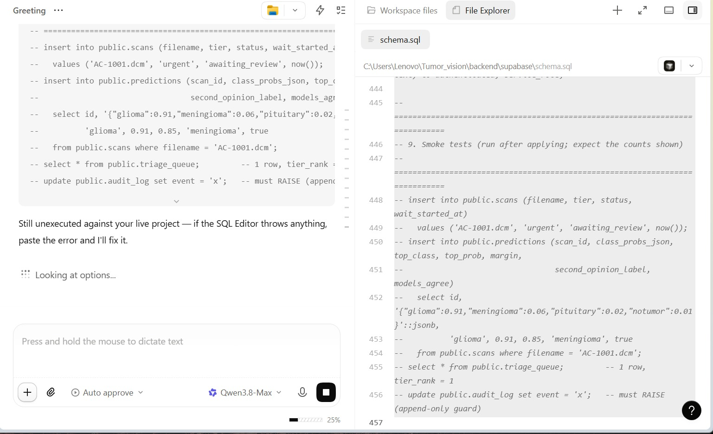

**Stack.** Next.js 15, React 19, Tailwind, three.js (frontend, on Vercel) · FastAPI, ONNX Runtime, ReportLab (backend, on Railway) · Supabase Postgres and Storage · WebSockets for live updates · PyTorch for training · 87 automated backend tests.

---

## 05 · Demo Evidence

- **Live product:** https://neuroqueue-one.vercel.app
- **Video:** `NeuroQueue-launch-video.mp4` (78 seconds, the full core flow from admin upload to the patient's report)
- **Screenshot sequence** (taken from a recording of the live site):

**1. Public home page: what NeuroQueue does and the headline numbers.**

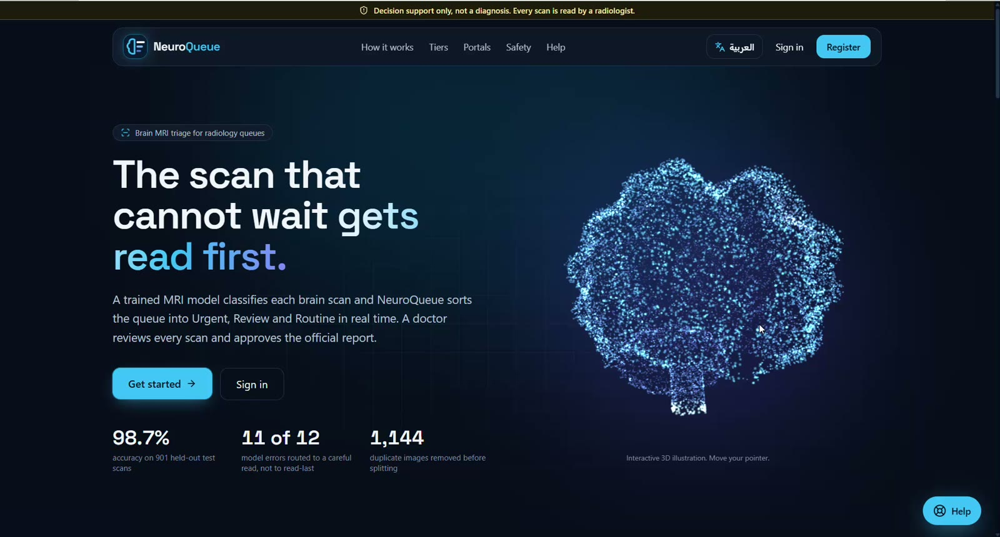

**2. Step 1. The administrator uploads one or many MRI images and chooses the doctor and the patient.**

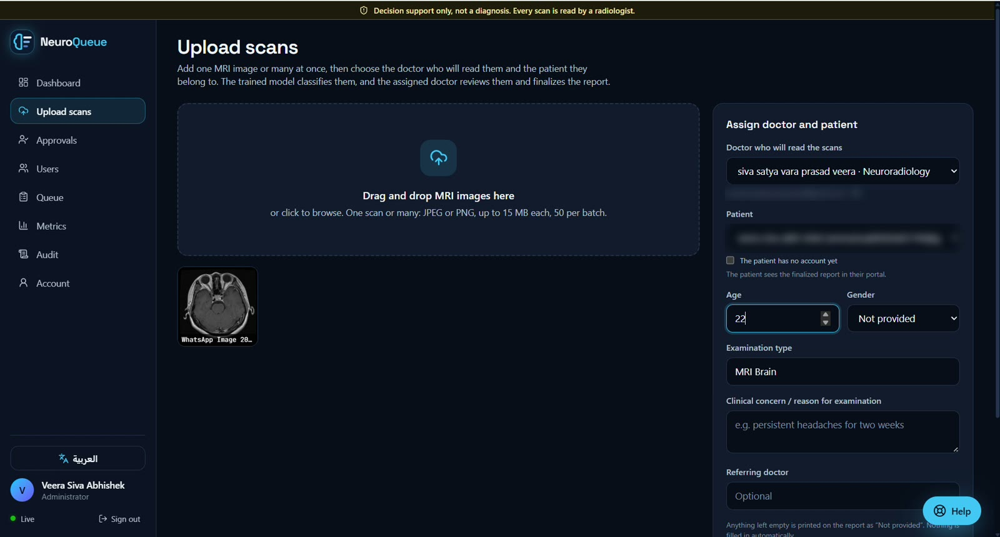

**3. Step 2. The trained model has classified the scans; the queue is sorted Urgent, Review, Routine, with the assigned doctor on each row.**

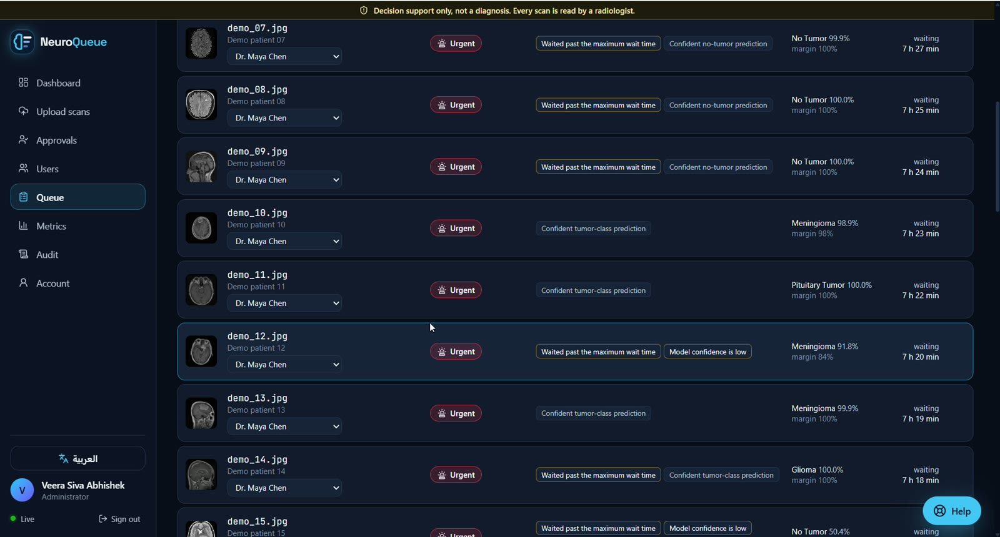

**4. Step 3. The doctor signs in and sees only the scans assigned to them.**

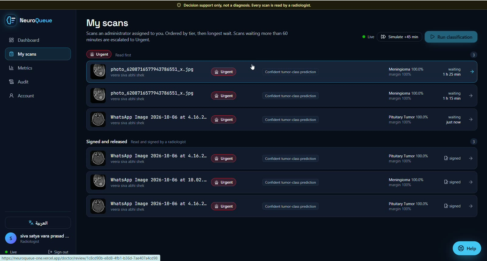

**5. Step 4. Review screen: the image, the probability for every class, the heatmap of where the model looked, and confirm or override.**

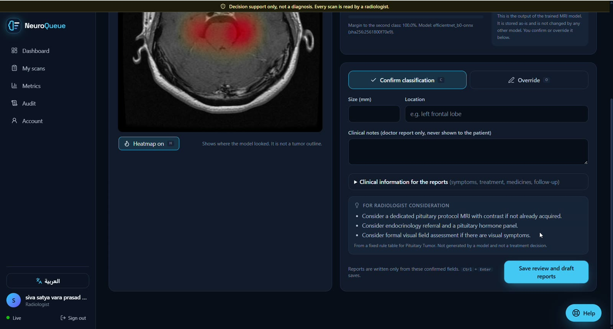

**6. Step 5. Saving the review drafts the clinical report and the plain-language finding automatically.**

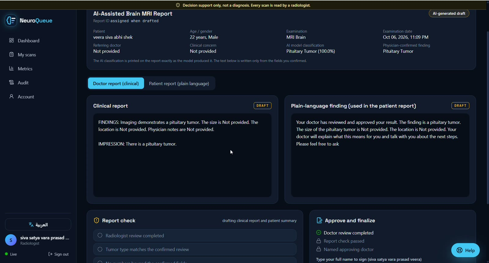

**7. Step 6. The six-row report check has passed and the doctor has approved and finalized the report.**

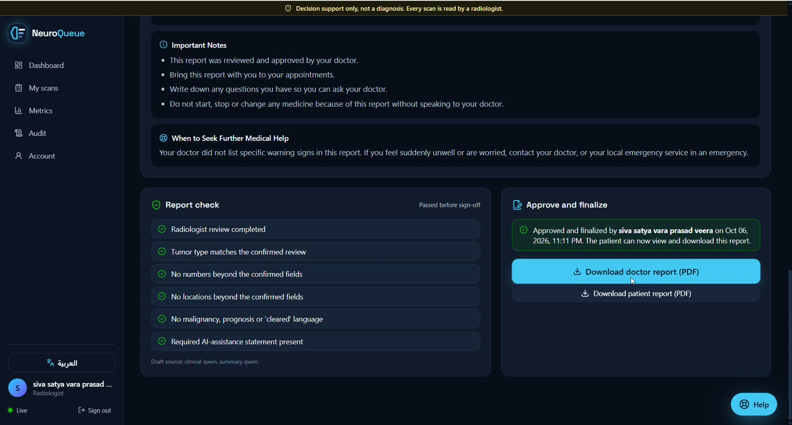

**8. Step 7a. The official clinical PDF for the doctor: model classification, probabilities, physician-approved findings.**

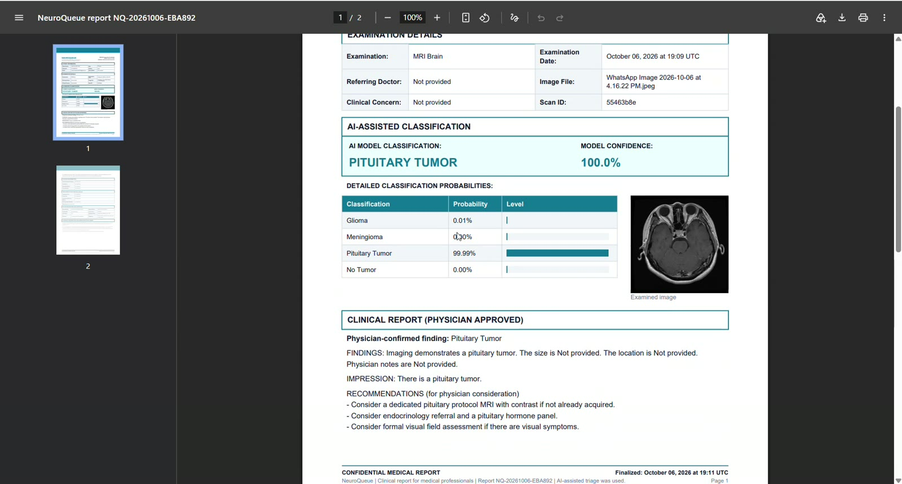

**9. Step 7b. The separate plain-language PDF for the patient.**

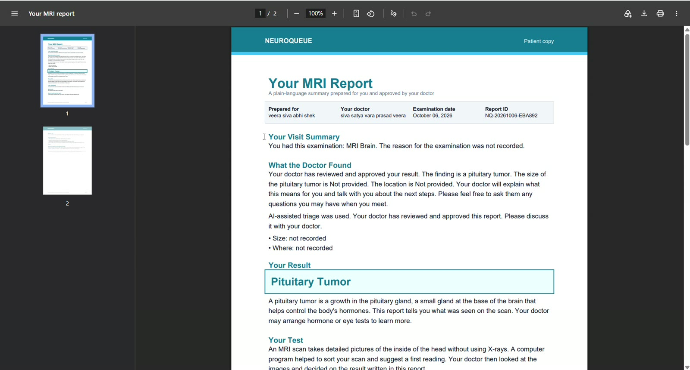

**10. Step 8. The patient signs in and sees only their own finalized reports.**

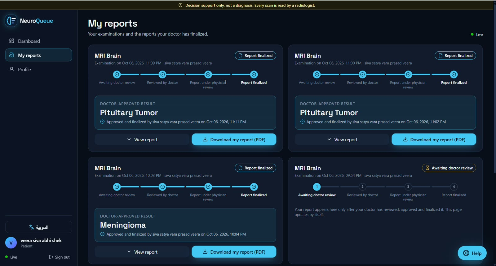

**11. Model metrics page: held-out test accuracy, recall, errors caught by the verifier, calibration, confusion matrix.**

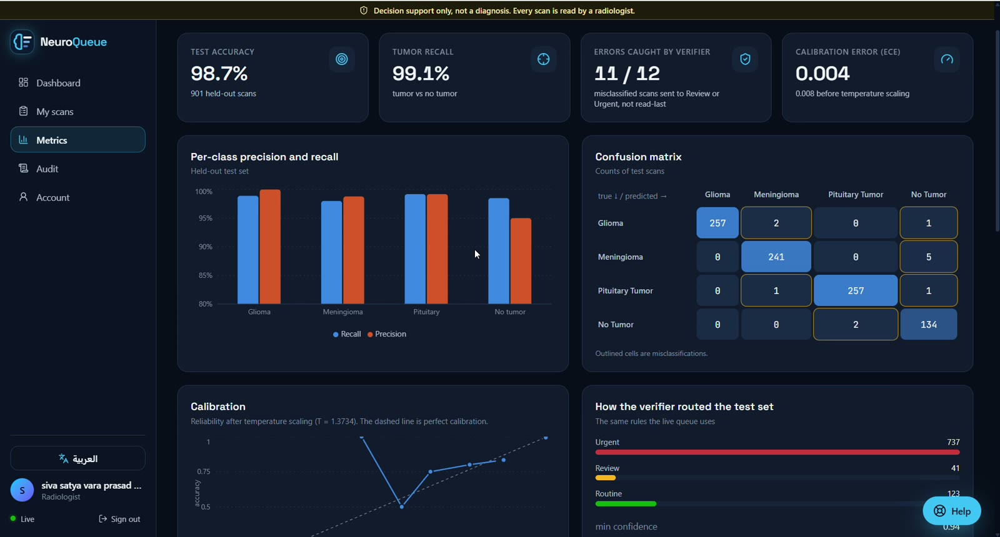

**12. Hash-chained audit log: upload, assignment, classification, review, draft, approval and patient access.**

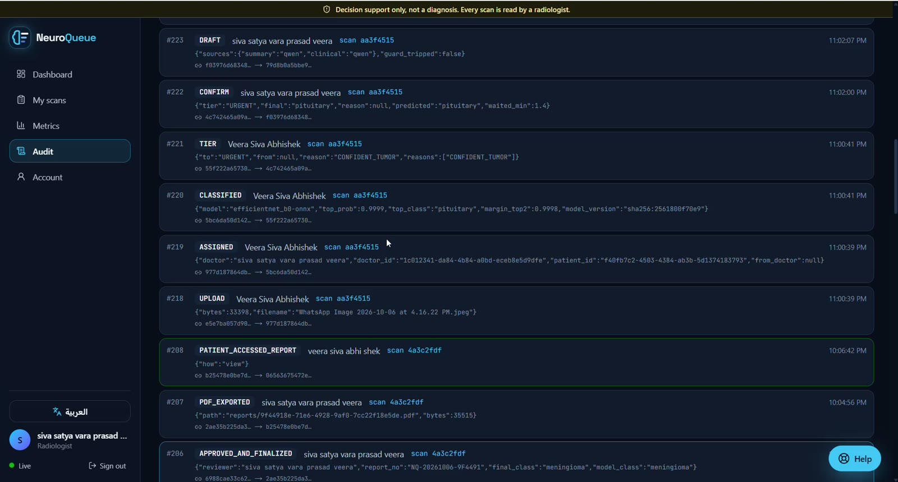

**13. Live administrator dashboard.**

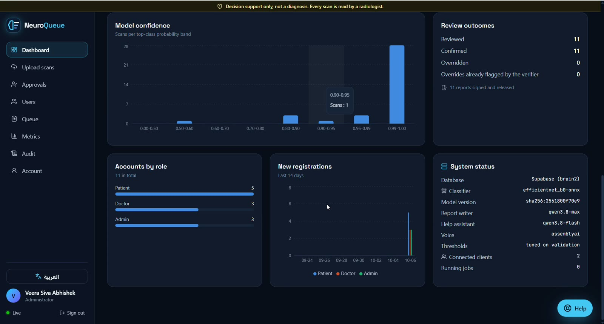

**14. The whole site switches between English and Arabic (right-to-left) with one button.**

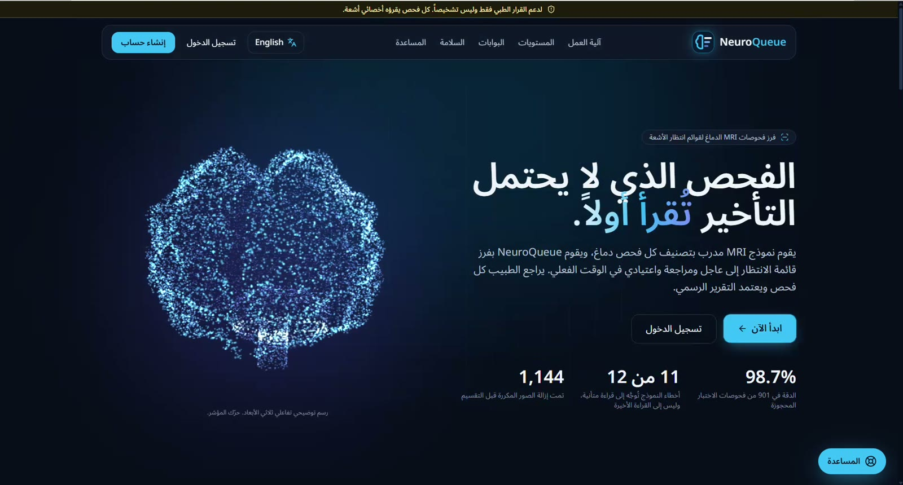

**15. Help assistant with voice: answers questions about the site, never medical advice.**

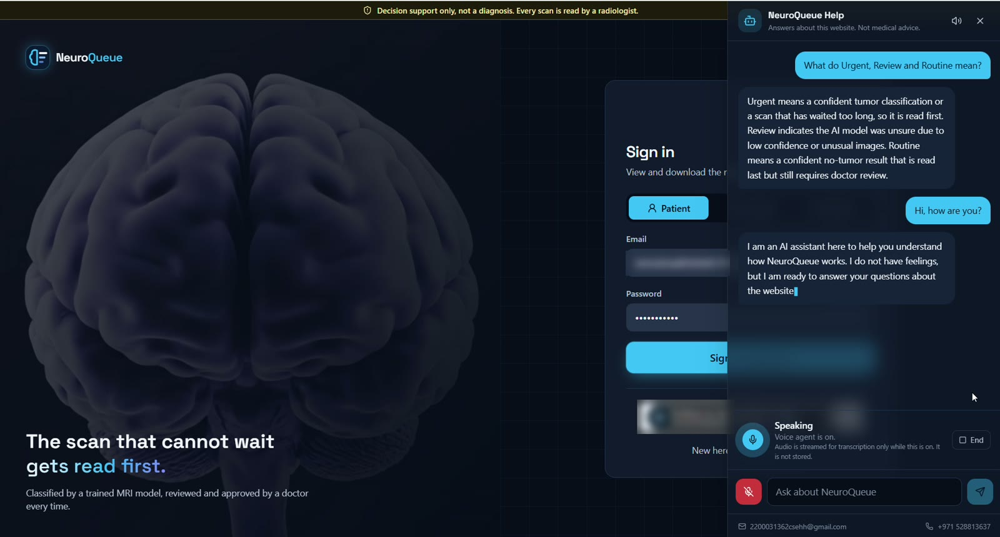

---

## 06 · Business Value

**Result: urgent scans are read sooner, with no extra staff and no extra total waiting.** We simulated a working day using the model's real held-out predictions (one radiologist, 9 scans per hour, 6 minutes per read, 200 simulated days):

| Wait before a doctor opens the scan | First-come, first-served | NeuroQueue |
|---|---|---|
| Tumour scans, mean | 17.8 min | **6.5 min** |
| Tumour scans, 90th percentile | 43.3 min | **11.7 min** |
| No-tumour scans, mean | 17.4 min | 21.1 min |
| All scans, mean | 17.5 min | 17.5 min |

The trade-off is explicit: normal scans wait a few minutes longer so that tumour scans wait about a third as long. These are simulated waiting times under the stated assumptions, not clinical outcomes.

**Other value**

- **Reporting time.** The doctor edits and signs a finished draft instead of typing a report from nothing.
- **Risk.** Of the 12 scans the model got wrong on the test set, 11 were still routed to a doctor's early attention by the verifier. Report wording that contradicts the doctor's review is blocked before signing.
- **Patient experience.** Patients get a plain-language report in their own portal, in English or Arabic.
- **Accountability.** Every action is in a hash-chained audit log that shows any later edit or deletion.

**Who would adopt it.** Imaging centres and hospital radiology departments, as a worklist-prioritisation and reporting-assistance layer.

---

## 07 · Risks & Next Steps

**Risks and the controls already built**

| Risk | Control in the product |
|---|---|
| The model is wrong | A doctor reads every scan; low-confidence and close-call predictions go to Review; an override is one click and is logged |
| A tumour scan is ranked Routine | Routine needs 99% confidence in "no tumour"; anything waiting over 60 minutes is escalated to Urgent; Routine means "read last", never "cleared" |
| The language model invents a finding | It only receives the doctor's confirmed fields; a deterministic check compares the text against them; forbidden phrases stop the draft as it is being written |
| A patient sees another patient's data, or an unsigned result | Access is enforced on the server by role and ownership; patients receive only finalized reports and never see model output |
| A doctor sees scans that are not theirs | Each scan is assigned to one doctor; other doctors are refused by the server |
| Records are altered afterwards | Append-only, hash-chained audit log |

**Honest limits**

- Trained and tested on one public dataset of 2D images. Performance on other scanners, hospitals and full 3D studies is unknown.
- Four classes only. It makes no malignancy or grading claims and uses no patient history.
- Not a medical device and not clinically validated. The waiting-time result is a simulation.
- Demo deployment on trial hosting; not yet configured for regulated health data.

**Before real clinical use**

1. Validate on data from other scanners and sites, with radiologist-labelled ground truth.
2. Run a reader study measuring real time-to-read and reporting time.
3. Move to compliant hosting with data-residency controls, and begin the regulatory pathway for decision-support software.

**Future scope**

1. **PACS and RIS integration.** Pull scans directly from the hospital's imaging system and push the signed report back, so nobody uploads anything by hand.
2. **Arabic reports.** The interface is already bilingual; next, the PDFs and the patient summary in Arabic too.
3. **Notifications.** An SMS or email to the patient when their report is ready, and an alert to the doctor when an Urgent scan is assigned.
4. **Beyond brain tumours.** Today it handles brain tumours. The same queue-and-report flow can serve any tumour type with a model trained for it.
5. **Tumour segmentation.** Outline the tumour and measure its size automatically, so the doctor confirms a measurement instead of typing one.
6. **Mobile app.** Patients view their report on their phone; doctors get urgent alerts.

---

## 08 · Team & Ownership

| Member | Responsibility |
|---|---|
| **Veera Siva Abhishek** | Team lead. Backend with Sanmeet; Google sign-in and account access; portal design and workflows after login; the English / Arabic experience; chatbot and voice assistant integration |
| **Veera Siva Abhiram** | Web application: interface and animations |
| **Sanmeet** | AI model (dataset, training, evaluation) and the backend with Abhishek |
| **Mohamed Abubakker** | Audit: the audit trail inside the web application |

The whole team owns the product decisions and the safety rules described above.

**Contact:** 2200031362csehh@gmail.com · +971 528813637
